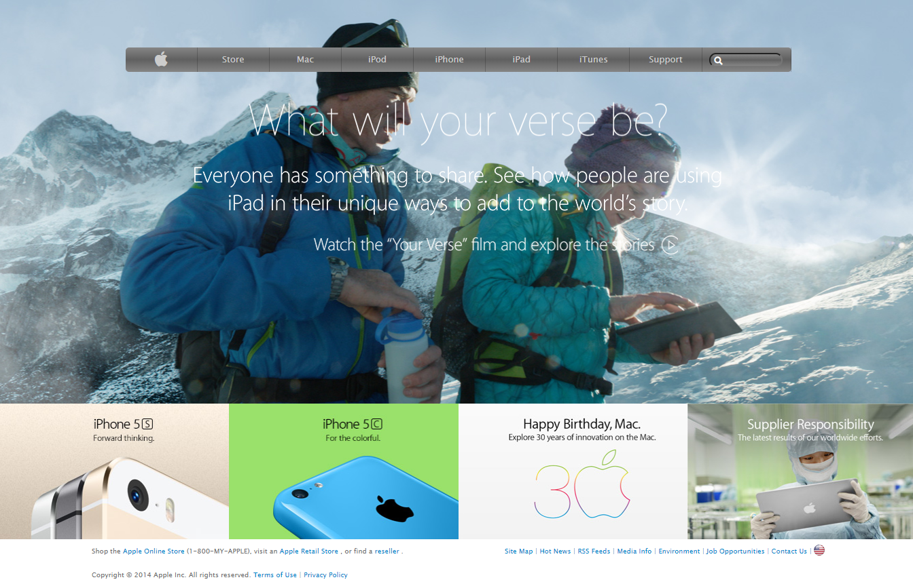

# Apple-clone

Fourth Microverse Project

# Project Name

> Cloning Apple page .

We cloned this page and made the main sections inside the page like:

- Gradient background for divs.
- Background images.
- The main body.
- The footer part for contact data of company.
- Footer part for other links.

## Built With

- HTML
- CSS
- FONTAWESOME

## Live Demo

[Live Demo Link](https://raw.githack.com/AhmedAmin90/Apple-clone/featured/index.html)

## Authors

👤 **Carlos Mario **

- GitHub: [@githubhandle](https://github.com/MrkarlosM)
- Twitter: [@twitterhandle](@MrkarlosM)
- LinkedIn: [LinkedIn](https://www.linkedin.com/in/carlos-mario-martinez-b1768355/)

👤 **Ahmed AMin**

- GitHub: [@githubhandle](https://github.com/AhmedAmin90)
- Twitter: [@twitterhandle](https://twitter.com/AhmedAmin12383)
- LinkedIn: [LinkedIn](https://www.linkedin.com/in/ahmed-amin-quality/)

## 🤝 Contributing

Contributions, issues, and feature requests are welcome!

Feel free to check the [issues page](https://github.com/MrkarlosM/nyt-article/issues).

## Show your support

Give a ⭐️ if you like this project!

## Acknowledgments

- Hat tip to anyone whose code was used
- Inspiration
- etc

## 📝 License

This project is [MIT](./LICENSE.md) licensed.